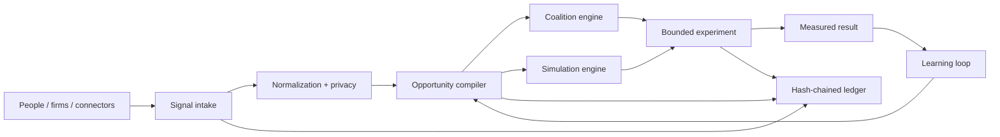

# DemandWeave — Human Opportunity Compiler

DemandWeave is an open-source platform that turns fragmented economic signals—needs, skills, idle assets, production capacity, logistics, inventory and capital—into testable business opportunities.

It is not a scraper, generic marketplace or chatbot wrapper. It is a **pre-market formation engine**:

```text
signals → normalization → opportunity graph → coalition → simulation → bounded experiment → measured learning
```

## What works in this repository

- Multi-tenant FastAPI API with registration, login and JWT authentication.
- Participant and capability registry.
- Structured and natural-language economic signal intake.
- Deterministic signal normalization and explainable opportunity scoring.
- Privacy scopes and threshold aggregation.
- Greedy coalition formation with role coverage and trust scoring.
- Monte Carlo unit-economics simulation with break-even, P10/P50/P90 and sensitivity.
- Experiment lifecycle and learning reports.
- HMAC-signed, revocable AI mandates with action and spend limits.
- Tamper-evident hash-chained event ledger.
- Connector and AI-provider plugin interfaces.
- React/TypeScript dashboard.
- Python and TypeScript SDKs.
- Docker Compose for API, web, worker, PostgreSQL and Redis.
- Automated tests and GitHub Actions.

## Example

Twenty cafés each need a small quantity of branded paper cups. A factory has idle weekend capacity, a designer has available hours, a carrier has empty return trips and a small investor can finance raw materials.

DemandWeave can:

1. aggregate the demand without exposing buyers prematurely;
2. identify the complementary resources;
3. compile an opportunity with evidence and missing-role analysis;
4. form a temporary coalition;
5. simulate downside and break-even volume;
6. create a bounded 14-day preorder experiment;
7. record the real result and recalibrate future scores.

## Quick start with Docker

```bash
cp .env.example .env
docker compose up --build
```

- Web: http://localhost:5173
- API: http://localhost:8000
- OpenAPI: http://localhost:8000/docs

Demo credentials after seeding:

```text
owner@demandweave.local / DemandWeave123!
```

## Local development

```bash
python -m venv .venv
source .venv/bin/activate  # Windows: .venv\Scripts\activate
pip install -r apps/api/requirements.txt
python scripts/seed_demo.py
uvicorn apps.api.app.main:app --reload --port 8000

cd apps/web
npm install
npm run dev
```

## Core API flow

```bash
# Register
curl -X POST http://localhost:8000/api/v1/auth/register \
  -H 'Content-Type: application/json' \
  -d '{"email":"you@example.com","password":"StrongPass123!","tenant_name":"My Network"}'

# Submit a natural-language signal
curl -X POST http://localhost:8000/api/v1/signals/natural \
  -H "Authorization: Bearer $TOKEN" \
  -H 'Content-Type: application/json' \
  -d '{"text":"Tôi có xưởng in ở Bắc Ninh, dư 30% công suất cuối tuần, nhận hộp giấy từ 20.000 chiếc"}'

# Compile opportunities
curl -X POST http://localhost:8000/api/v1/opportunities/compile \
  -H "Authorization: Bearer $TOKEN"
```

## Architecture



## Safety model

AI may propose, classify and explain. Deterministic code handles money, permissions, scoring and ledger integrity. External actions require a signed mandate and may require human approval.

## Repository status

This is a working open-source reference implementation, not a promise of business success. Production deployments still need organization-specific identity verification, payment/escrow, contractual workflows, local compliance review and real market data.

See [`docs/`](docs/) for architecture, domain model, security, business model and roadmap.

## License

Apache-2.0.
