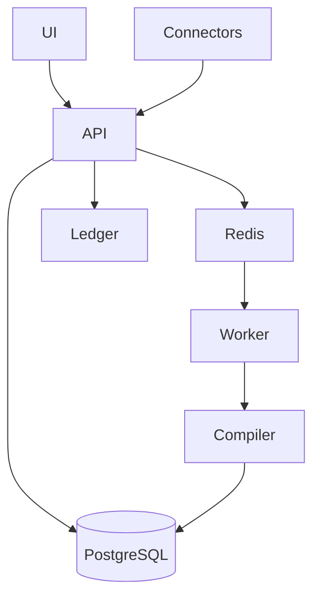

# Architecture

The API owns deterministic domain logic. AI adapters are optional. PostgreSQL stores tenant-scoped records, Redis supports workers, React provides the operator interface, and the ledger records sensitive transitions.

